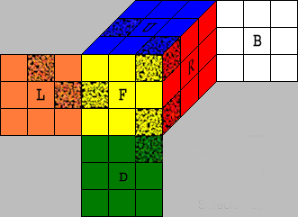

# RKsolver

посмотрим на кубик рубика 3х3х3.
каждая его грань отмечена буквой.

| Буква | Грань |
|---|---|
| F | Фронтальная |
| B | Задняя |
| U | Верхняя |
| D | Нижняя |
| L | Левая |
| R | Правая |

На основе этого можно дать названия углам и ребрам кубика.
На изображении выше отмечены URF-угол, DFR-угол, FL-край и UL-край.
Логика названий элементов я считаю очевидна.

Таким образом мы имеем следующие элементы:
- углы URF, UFL, ULB, UBR, DFR, DLF, DBL и DRB.
- ребра UR, UF, UL, UB, DR ,DF, DL, DB, FR, FL, BL и BR.

У каждого из этих элементов есть положение и ориентация.

# ходы кубика

у кубика есть 12 возможных ходов

- U, U', D, D', L, L', R, R', F, F', B, B'

в данной нотации буква обозначает то какую грань вращают, а наличие одинарной кавычки означает поворот против часовой стрелки, в случае же ее отсутствия - по часовой.

